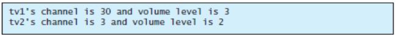
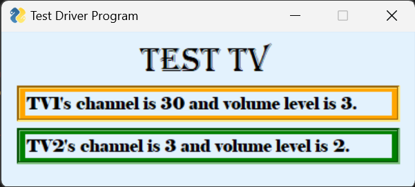

# TV Class and Test Driver Program
a Python Code for creating the Class named TV and a Test Driver program named TestTV that will create two objects from Class TV and will produce the following output:
> 

## Installation
To run the program, you'll need to have [Python 3](https://www.python.org/downloads/) installed on your computer. <br/>
>**Note: This program might works only for windows os.**
<br/>

I used [VS Code](https://code.visualstudio.com/download) to create and run the program.

## Dependencies
The script requires the following Python packages:
* PySimpleGUI
```pip install PySimpleGUI```

## How the code works
1. Clone the repository.
2. Open a terminal and navigate to the directory containing the script:
``cd /path/to/directory``
3. Run the script using python:
``python TestTV.py``
4. The python file will read another python class file called **TV.py**.
5. Finally, it will display the output.
> 

## Found a bug?
contact me through facebook. Link is in my profile.